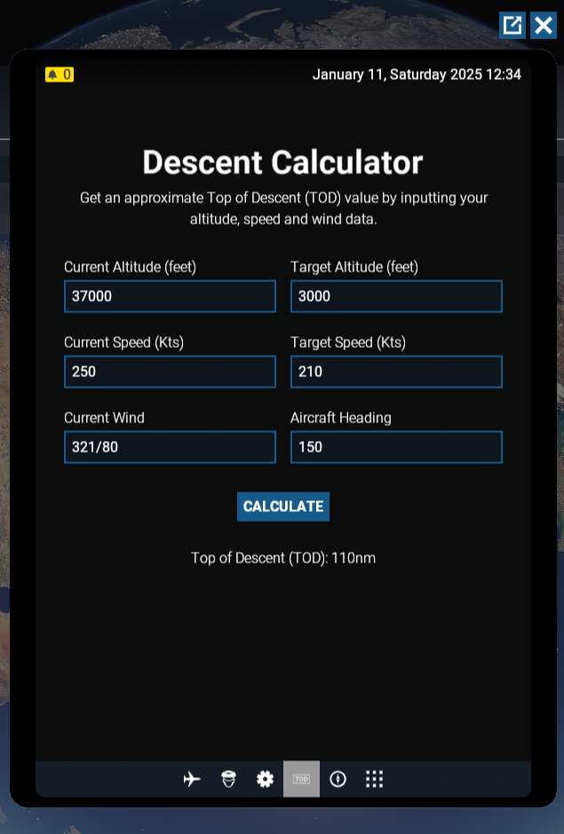

# EFB Descent Calculator for MSFS 2024

A simple descent calculator for Microsoft Flight Simulator 2024, designed to be added to the built-in EFB as an app. This tool was created with airliners in mind but should theoretically work well for general aviation (GA) aircraft too.

This calculator uses the standard 3:1 rule of descent while also accounting for speed changes during descent and headwind/tailwind effects.

Download: https://flightsim.to/file/87308/efb-descent-calculator

## For Developers

If you are looking to use this project as a reference for developing your own EFB apps, note that this repository only contains the contents of the "TemplateApp" folder w.r.t the EFB sample project in MSFS24 SDK.
